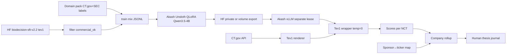

# Architecture — BioDecision Public

Portable pipeline from commercial_ok SFT → Akash train/serve → CT.gov scoring → human thesis journal.

Prior notes: `/workspace/research/biodecision-akash-clinical-scoring.md`, `/workspace/research/personal-jev-akash-unsloth.md`.

---

## Components (left → right)

1. **Data filter** — `lighteternal/biodecision-sft-v2.2` config `tev1`; keep `commercial_ok==True`; drop TrialBench and other blocked sources; never use `benchmark` for train; `calibration` for temp fit only. Script: `scripts/filter_commercial_ok.py`.
2. **Domain pack** — small historical pack (hundreds–thousands) of public-company trial outcomes labeled by you from CT.gov + press/SEC (ordered options: clear win / mixed / fail / stop for AE, etc.). Makes the product “investment thesis,” not exam QA.
3. **Unsloth train** — Awesome Akash Unsloth AI lease (A100/H100); QLoRA on Qwen3.5-4B; tev1 `prompt`/`completion`; persist under `/workspace/work`; change passwords; pin image tag; smoke 20–50k first; tear down lease. Runbook: `runbooks/AKASH-UNSLOTH-TRAIN.md`.
4. **HF / volume export** — LoRA adapter and/or merged weights to private HF repo **or** Akash persistent volume. No secrets in git.
5. **vLLM serve** — **separate** Awesome Akash vLLM lease; OpenAI-compatible chat; model id = your export. Runbook: `runbooks/AKASH-VLLM-SERVE.md`.
6. **Tev1 API wrapper** — accept `{state, question, options[{label,key,description}]}`; inject system prompt; `temperature=0`, `max_tokens≈8`, non-thinking; parse letter → `{label, key, raw}`.
7. **CT.gov ingest** — ClinicalTrials.gov API by NCT / sponsor; normalize protocol synopsis, endpoints, phase, status. Sketch: `docs/CTGOV-TEV1-RENDERER.md`, stub: `scripts/render_ctgov_tev1.py`.
8. **Company rollup** — score active programs; pipeline risk heatmap + readout calendar at sponsor/company level.
9. **Human thesis journal** — scores as **priors / flags**, not auto-trade; log predictions vs later readouts for calibration (Phase 4).

---

## Mermaid

---

## Lease split (mandatory)

| Lease | Role | Tear down? |
|-------|------|------------|
| Unsloth AI | Train only | Yes, after export |
| vLLM (+ wrapper) | Inference only | Keep while serving |

Do not leave Unsloth Studio as production. Do not leave GPU train idle.

---

## Out of scope in this diagram

- Stock return prediction models
- Commercial use of TrialBench / blocked sources
- Auto-execution / brokerage hooks
